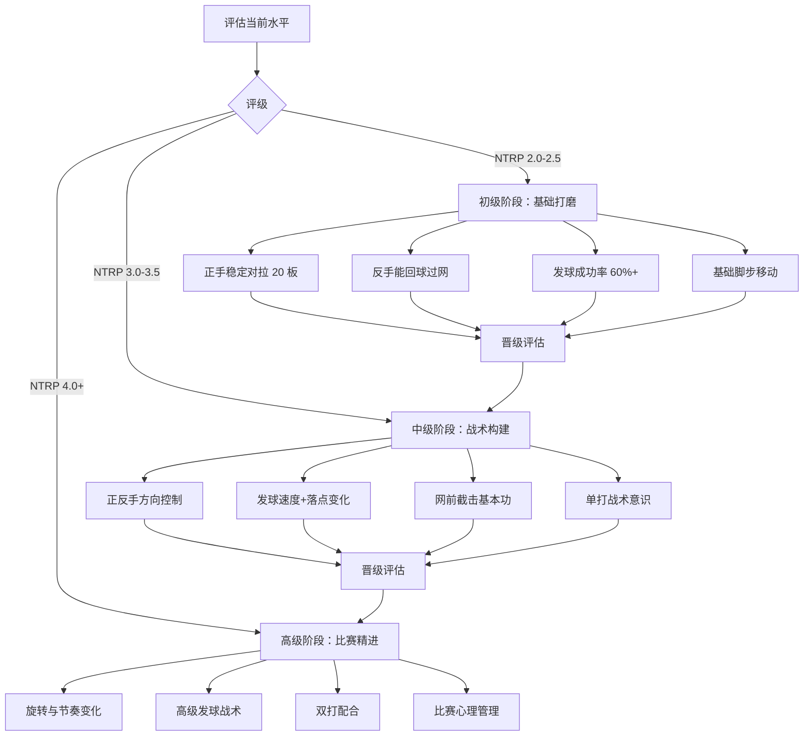
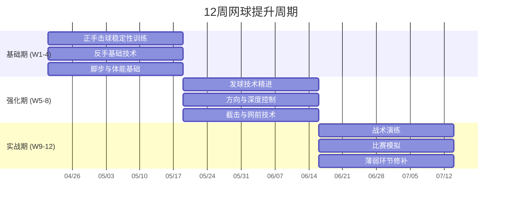
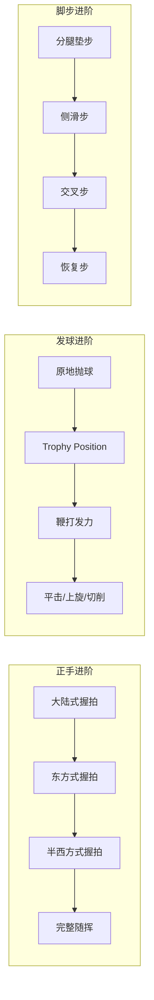
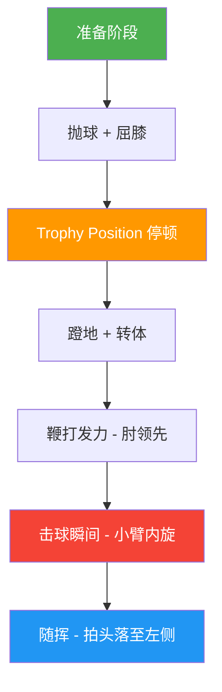
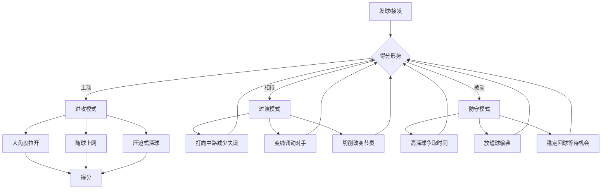
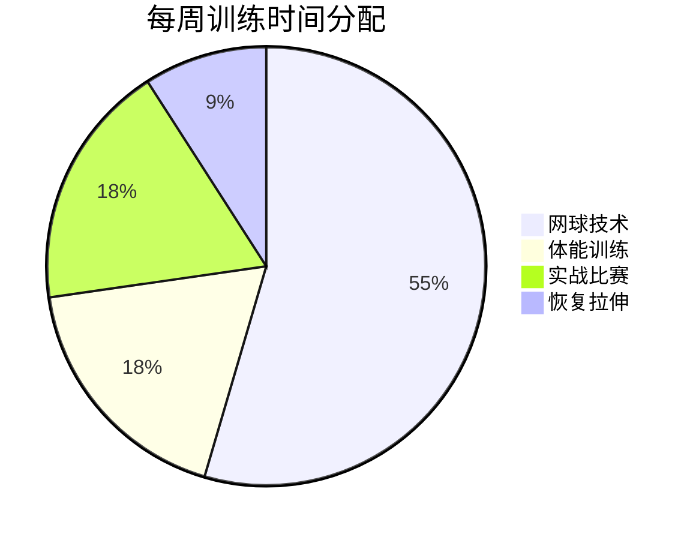

# 🎾 网球提升计划

## 一、整体进阶路线

## 二、12 周训练周期

## 三、每周训练安排

| 日期 | 训练主题 | 时长 | 重点内容 |
|------|---------|------|---------|
| **周一** | 体能训练 | 60min | 核心力量、敏捷梯、折返跑 |
| **周二** | 正手+脚步 | 90min | 对拉、移动击球、交叉步 |
| **周三** | 休息/拉伸 | 30min | 瑜伽或泡沫轴放松 |
| **周四** | 反手+发球 | 90min | 双手反手、平击/切削发球 |
| **周五** | 网前+综合 | 90min | 截击、高压球、随球上网 |
| **周六** | 实战对打 | 120min | 计分比赛、战术执行 |
| **周日** | 休息 | - | 观看比赛录像、复盘 |

## 四、核心技术突破流程

## 五、发球技术拆解

### 发球检查清单

- [ ] 抛球高度一致且稳定（比击球点高 15-20cm）
- [ ] 抛球时重心在后脚
- [ ] Trophy Position 有明确停顿
- [ ] 肘部先于手腕向上
- [ ] 击球时身体完全伸展
- [ ] 落点能在发球区 T 点 / 追身 / 外角三个区域切换

## 六、比赛战术决策树

## 七、体能训练计划

### 核心体能指标

| 指标 | 基础目标 | 进阶目标 | 测试方法 |
|------|---------|---------|---------|
| 敏捷 | 5-10-5 折返 < 5.0s | < 4.5s | 三角折返跑 |
| 爆发 | 垂直弹跳 > 40cm | > 50cm | 摸高测试 |
| 耐力 | 连续对拉 30min | 连续对拉 60min | 对拉计数 |
| 核心 | 平板支撑 > 90s | > 180s | 计时支撑 |

## 八、阶段自测标准

### 基础期达标（第 4 周末）

- [ ] 正手对拉 20 板不失误
- [ ] 反手对拉 10 板不失误
- [ ] 发球 10 个中 6 个进区
- [ ] 能完成分腿垫步 + 移动击球

### 强化期达标（第 8 周末）

- [ ] 正手能控制 3 个方向（直线、斜线、中路）
- [ ] 二发上旋发球稳定入区
- [ ] 网前截击 10 个中 8 个过网且深
- [ ] 单打比赛中能执行基本战术

### 实战期达标（第 12 周末）

- [ ] 能根据对手弱点调整战术
- [ ] 发球有平击 / 上旋两种变化
- [ ] 比赛中失误率控制在 30% 以内
- [ ] 打完一盘比赛体能充沛

## 九、推荐资源

- **书籍**: 《Tennis Tactics》- ITF 官方战术指南
- **视频**: Essential Tennis 频道（YouTube）
- **训练工具**: 发球机、目标锥、弹力绳
- **记录工具**: SwingVision（AI 分析击球数据）

---

> 💡 **使用方法**: 每周日晚上对照检查清单复盘当周训练，记录完成情况和下周调整方向。在文件末尾添加 `## 训练日志` 按日期记录进步。
